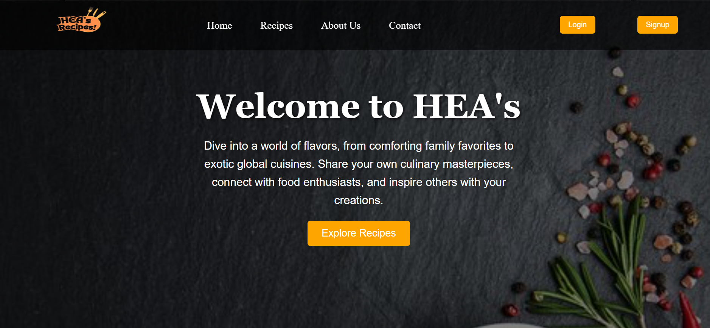
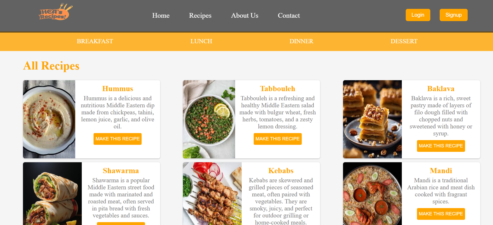
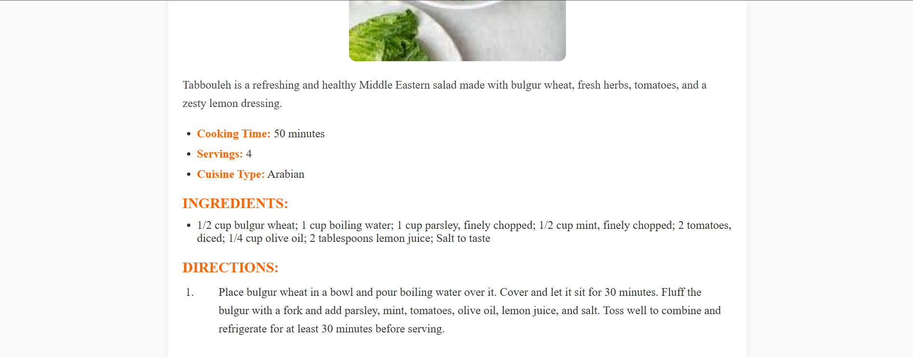
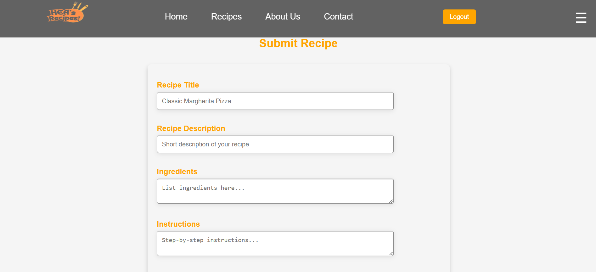
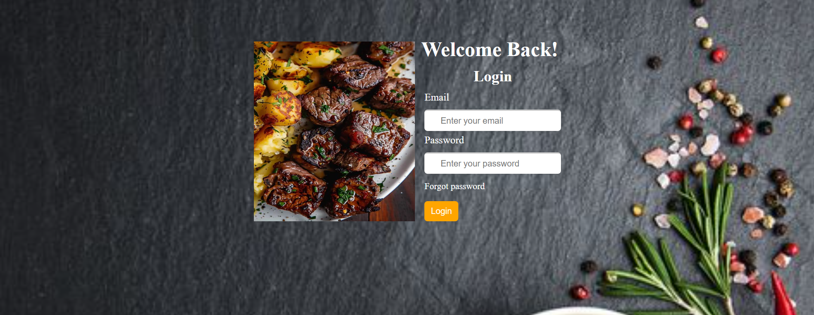

🍽️ Recipe Sharing Platform

A full-stack web application that enables users to discover, create, and manage recipes with authentication and personalized features.

---

🚀 Live Demo
🔗 (Add your link here)

---

📌 Overview
This platform allows users to browse recipes, contribute their own, and manage favorites in a user-friendly environment with responsive design.

---

✨ Key Features

👤 User Features
- User authentication (registration & login)
- Create, edit, and delete recipes (CRUD)
- Upload recipe images
- Search and filter recipes
- Save and manage favorite recipes
- Fully responsive UI

🛠 Admin Features
- Manage users and recipes
- Approve, edit, and delete content
- Basic admin dashboard

---

🛠 Tech Stack
- PHP, MySQL
- HTML5, CSS3, JavaScript
- XAMPP

---

👨‍💻 What I Built
- Designed and implemented relational database (users, recipes, favorites)
- Developed full CRUD functionality for recipe management
- Built authentication system for secure user access
- Created responsive UI for better usability across devices

---

 📸 Screenshots

 Homepage

 Recipe List

 Recipe Detail

 Submit Recipe

 Login 

⚙️ Run Locally
1. Install XAMPP  
2. Place project in `htdocs`  
3. Start Apache & MySQL  
4. Import database  
5. Open in browser  

---

🚧 Status
Actively improving and adding new features.
